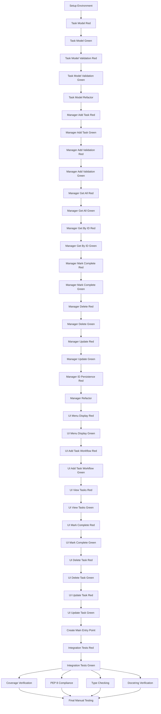

# Task Breakdown: Phase I - In-Memory Python Console Todo App

**Generated**: 2026-01-02
**Feature**: phase-1-todo-app
**Specification**: specs/phase-1-todo-app/spec.md
**Plan**: specs/phase-1-todo-app/plan.md
**Total Tasks**: 42
**Estimated Effort**: 20-34 hours
**Priority Distribution**: 18 High, 18 Medium, 6 Low

## Critical Path

The minimum timeline follows this sequence of high-priority tasks:

1. T-001: Project setup and environment
2. T-002 → T-006: Task Model (TDD)
3. T-007 → T-022: TaskManager Core CRUD (TDD)
4. T-023 → T-034: MenuUI Implementation (TDD)
5. T-035 → T-037: Integration and wiring
6. T-038 → T-042: Quality gates and documentation

## Task Dependencies



---

## Phase 1: Environment Setup & Infrastructure

### Task T-001: Project Setup and Environment Configuration

**From**: Constitution §Development Workflow, Plan §8 File Structure
**Priority**: High
**Depends On**: None
**Type**: Infrastructure
**Estimated Effort**: Small (1-2h)

**Description**:
Set up the Python project structure with proper directory organization, initialize testing infrastructure, and configure linting/type checking tools. This task creates the foundation for TDD-driven development and ensures all quality gates are ready from the start.

**Acceptance Criteria**:
- [ ] Project directory structure created: `todo_app/models/`, `todo_app/manager/`, `todo_app/ui/`, `todo_app/tests/`
- [ ] All directories contain `__init__.py` files for proper Python package structure
- [ ] `requirements.txt` created with dependencies: pytest, pytest-cov, mypy, flake8/black
- [ ] Virtual environment created and activated successfully
- [ ] All dependencies installed and verified (`pip list` shows correct versions)
- [ ] pytest runs successfully (no tests yet, but framework works)
- [ ] mypy runs successfully with strict mode enabled
- [ ] flake8 or black runs successfully (linter configured)
- [ ] `.gitignore` created to exclude `__pycache__/`, `*.pyc`, `.pytest_cache/`, `.mypy_cache/`, `venv/`

**Files to Modify**:
- `todo_app/__init__.py` - Create empty package marker
- `todo_app/models/__init__.py` - Create empty package marker
- `todo_app/manager/__init__.py` - Create empty package marker
- `todo_app/ui/__init__.py` - Create empty package marker
- `todo_app/tests/__init__.py` - Create empty package marker
- `requirements.txt` - Add pytest, pytest-cov, mypy, flake8
- `.gitignore` - Add Python-specific ignore patterns

**Expected Output**:
Complete project structure with working test framework, type checker, and linter. Running `pytest` shows "0 tests collected" (not an error). Running `mypy todo_app` shows "Success: no issues found". Running `flake8 todo_app` shows no violations.

**Technical Notes**:
Use Python 3.10+ for modern type hint support (e.g., `list[Task]` instead of `List[Task]`). Configure mypy with strict mode in `mypy.ini` or `pyproject.toml`. This setup enables the TDD workflow for all subsequent tasks.

---

## Phase 2: Models Layer (TDD Cycles)

### Task T-002: [RED] Write Failing Tests for Task Model Creation

**From**: speckit.specify §Data Model Requirements, speckit.plan §2 Components (Task)
**Priority**: High
**Depends On**: T-001
**Type**: Test
**Estimated Effort**: Small (0.5-1h)

**Description**:
Write comprehensive failing tests for Task dataclass creation, covering valid instantiation, attribute access, and basic validation. This task follows the Red phase of TDD - tests must fail initially because Task model doesn't exist yet.

**Acceptance Criteria**:
- [ ] Test file `tests/test_task.py` created with proper imports
- [ ] Test `test_task_creation_with_valid_attributes` - creates Task(id=1, title="Test", completed=False) and verifies all attributes
- [ ] Test `test_task_creation_defaults_completed_to_false` - creates Task(id=1, title="Test") and verifies completed defaults to False
- [ ] Test `test_task_attributes_are_accessible` - verifies task.id, task.title, task.completed can be read
- [ ] Test `test_task_repr_includes_all_fields` - verifies __repr__ output contains id, title, and completed
- [ ] All tests fail with ImportError or AttributeError (Task class doesn't exist)
- [ ] Tests follow pytest conventions (test_ prefix, descriptive names)
- [ ] Test assertions use pytest idioms (assert, pytest.raises)

**Files to Modify**:
- `todo_app/tests/test_task.py` - Create with failing tests for Task creation

**Expected Output**:
Test file with 4-5 failing tests. Running `pytest tests/test_task.py` shows all tests failing with clear import/attribute errors. Tests are well-structured and ready for Green phase.

**Technical Notes**:
Use `from todo_app.models.task import Task` import (will fail initially). Structure tests with clear Given-When-Then comments. Use descriptive assertion messages for clarity.

---

### Task T-003: [GREEN] Implement Task Model to Pass Creation Tests

**From**: speckit.specify §Data Model Requirements, speckit.plan §2 Components (Task)
**Priority**: High
**Depends On**: T-002
**Type**: Model
**Estimated Effort**: Small (0.5-1h)

**Description**:
Implement the minimal Task dataclass required to pass the creation tests from T-002. Use Python's @dataclass decorator to automatically generate __init__, __repr__, and __eq__ methods. This is the Green phase - write only enough code to make tests pass.

**Acceptance Criteria**:
- [ ] File `models/task.py` created with Task dataclass
- [ ] Task has three attributes: id (int), title (str), completed (bool)
- [ ] completed attribute defaults to False using dataclass field default
- [ ] @dataclass decorator used for automatic method generation
- [ ] All tests from T-002 now pass (pytest shows 100% pass rate)
- [ ] No additional functionality beyond what tests require
- [ ] Type hints present for all attributes
- [ ] Class-level docstring added following Google/NumPy style

**Files to Modify**:
- `todo_app/models/task.py` - Create Task dataclass with id, title, completed attributes
- `todo_app/models/__init__.py` - Export Task for easier imports (optional but recommended)

**Expected Output**:
Working Task dataclass that passes all creation tests. Running `pytest tests/test_task.py` shows all tests green. Class is minimal and focused only on passing tests.

**Technical Notes**:
Use `@dataclass` from Python's dataclasses module. Syntax: `completed: bool = False` for default value. Ensure type hints are specific (int, str, bool - no Any types).

---

### Task T-004: [RED] Write Failing Tests for Task Validation

**From**: speckit.specify §Data Model Requirements (Task Title Validation, Task ID Validation)
**Priority**: High
**Depends On**: T-003
**Type**: Test
**Estimated Effort**: Small (0.5-1h)

**Description**:
Write failing tests for Task validation logic in __post_init__, covering invalid IDs (non-positive integers) and invalid titles (empty or whitespace-only strings). Tests should verify that ValueError is raised with appropriate messages.

**Acceptance Criteria**:
- [ ] Test `test_task_rejects_zero_id` - Task(id=0, title="Test") raises ValueError with message containing "positive integer"
- [ ] Test `test_task_rejects_negative_id` - Task(id=-1, title="Test") raises ValueError
- [ ] Test `test_task_rejects_empty_title` - Task(id=1, title="") raises ValueError with message containing "cannot be empty"
- [ ] Test `test_task_rejects_whitespace_only_title` - Task(id=1, title="   ") raises ValueError
- [ ] Test `test_task_accepts_valid_data` - Task(id=1, title="Valid Task") succeeds (positive control)
- [ ] All validation tests currently fail (no __post_init__ validation exists yet)
- [ ] Tests use `pytest.raises(ValueError)` context manager correctly
- [ ] Tests verify exception messages contain expected keywords

**Files to Modify**:
- `todo_app/tests/test_task.py` - Add validation test cases

**Expected Output**:
5 new failing tests in test_task.py. Running pytest shows failures because Task doesn't validate inputs yet. Tests are structured to verify both exception type and message content.

**Technical Notes**:
Use `with pytest.raises(ValueError, match=r"positive integer"):` to check exception message patterns. The `match` parameter accepts regex patterns for flexible message validation.

---

### Task T-005: [GREEN] Implement Task Validation in __post_init__

**From**: speckit.specify §Data Model Requirements, speckit.plan §3 Interfaces (Task Data Model)
**Priority**: High
**Depends On**: T-004
**Type**: Model
**Estimated Effort**: Small (0.5-1h)

**Description**:
Add __post_init__ method to Task dataclass to validate id and title attributes. Raise ValueError with descriptive messages when validation fails. This implements the data integrity requirements from the specification.

**Acceptance Criteria**:
- [ ] `__post_init__` method added to Task class
- [ ] Validation checks id > 0, raises ValueError("Task ID must be a positive integer") if not
- [ ] Validation checks title is not empty after stripping whitespace, raises ValueError("Task title cannot be empty") if empty
- [ ] All validation tests from T-004 now pass
- [ ] All creation tests from T-002 still pass (no regression)
- [ ] Validation logic is minimal and focused (no over-engineering)
- [ ] Type hints maintained for __post_init__ (returns None)
- [ ] Docstring added to __post_init__ explaining validation behavior

**Files to Modify**:
- `todo_app/models/task.py` - Add __post_init__ validation method

**Expected Output**:
Task class with working validation. Running `pytest tests/test_task.py` shows 100% pass rate for all ~9 tests. Invalid Task creation now raises clear ValueError messages.

**Technical Notes**:
Use `self.title.strip()` to remove whitespace before checking emptiness. Validation order: check id first, then title. This matches the plan's validation specification.

---

### Task T-006: [REFACTOR] Improve Task Model Code Quality

**From**: Constitution §II Clean Code, Constitution §Quality Gates
**Priority**: Medium
**Depends On**: T-005
**Type**: Model
**Estimated Effort**: Small (0.5-1h)

**Description**:
Refactor Task model for optimal code quality while keeping all tests green. Add comprehensive docstrings, verify type hints, ensure PEP 8 compliance, and improve code clarity. This is the Refactor phase of TDD.

**Acceptance Criteria**:
- [ ] Class docstring updated with comprehensive description of Task purpose and attributes
- [ ] Each attribute has inline comment or docstring explaining its purpose
- [ ] __post_init__ docstring explains validation rules and exceptions raised
- [ ] All type hints verified with mypy (no errors)
- [ ] PEP 8 compliance verified with flake8 (no violations)
- [ ] All tests from T-002 through T-005 still pass (no regressions)
- [ ] Code coverage for models/task.py is 100% (verified with pytest-cov)
- [ ] No unnecessary complexity added (YAGNI principle)

**Files to Modify**:
- `todo_app/models/task.py` - Enhance docstrings, verify type hints, ensure PEP 8 compliance

**Expected Output**:
Production-quality Task model with excellent documentation and code quality. Running `mypy todo_app/models/task.py` shows no errors. Running `flake8 todo_app/models/task.py` shows no violations. Running `pytest --cov=todo_app/models tests/test_task.py` shows 100% coverage.

**Technical Notes**:
Use Google-style or NumPy-style docstrings consistently. Include Attributes section in class docstring. Include Raises section in __post_init__ docstring. This completes the Models layer.

---

## Phase 3: Manager Layer (TDD Cycles for CRUD Operations)

### Task T-007: [RED] Write Failing Tests for TaskManager.add_task

**From**: speckit.specify §User Story 1 (Add Task), speckit.plan §2 Components (TaskManager)
**Priority**: High
**Depends On**: T-006
**Type**: Test
**Estimated Effort**: Medium (1-2h)

**Description**:
Write comprehensive failing tests for TaskManager.add_task method, covering successful task creation with auto-incrementing IDs, title validation, and whitespace trimming. Tests should verify the manager's core responsibility: creating and storing tasks.

**Acceptance Criteria**:
- [ ] Test file `tests/test_task_manager.py` created with TaskManager import
- [ ] Test `test_add_first_task_generates_id_one` - add_task("Test") returns Task with id=1
- [ ] Test `test_add_second_task_generates_id_two` - adding two tasks generates IDs 1 and 2
- [ ] Test `test_add_task_trims_whitespace` - add_task("  Test  ") returns Task with title="Test"
- [ ] Test `test_add_task_raises_error_for_empty_title` - add_task("") raises ValueError
- [ ] Test `test_add_task_raises_error_for_whitespace_only_title` - add_task("   ") raises ValueError
- [ ] Test `test_add_task_returns_task_with_completed_false` - new task has completed=False
- [ ] All tests fail with ImportError or AttributeError (TaskManager doesn't exist)
- [ ] Tests use pytest fixtures for TaskManager setup (fresh instance per test)

**Files to Modify**:
- `todo_app/tests/test_task_manager.py` - Create with failing tests for add_task

**Expected Output**:
Test file with 6-7 failing tests for add_task. Tests verify ID generation, validation, and return values. Running pytest shows clear failures indicating TaskManager needs to be implemented.

**Technical Notes**:
Use pytest fixture: `@pytest.fixture def manager() -> TaskManager: return TaskManager()`. This ensures each test gets a fresh manager instance. Tests should verify both successful operations and error cases.

---

### Task T-008: [GREEN] Implement TaskManager.add_task Minimal Logic

**From**: speckit.specify §FR-002, FR-003, FR-011, FR-012, speckit.plan §2 Components (TaskManager)
**Priority**: High
**Depends On**: T-007
**Type**: Logic
**Estimated Effort**: Medium (1-2h)

**Description**:
Implement TaskManager class with add_task method that generates unique IDs, validates titles, and stores tasks in a dictionary. This is the minimal implementation to pass T-007 tests, focusing on core CRUD functionality.

**Acceptance Criteria**:
- [ ] File `manager/task_manager.py` created with TaskManager class
- [ ] `__init__` method initializes `_tasks: dict[int, Task] = {}` and `_next_id: int = 1`
- [ ] `add_task(title: str) -> Task` method implemented with full type hints
- [ ] Method trims whitespace from title using `title.strip()`
- [ ] Method raises ValueError if trimmed title is empty (message: "Task title cannot be empty")
- [ ] Method creates Task with `self._next_id`, trimmed title, and completed=False
- [ ] Method stores task in `self._tasks[task.id] = task`
- [ ] Method increments `self._next_id` after creation
- [ ] Method returns the created Task object
- [ ] All tests from T-007 now pass
- [ ] Class-level docstring added explaining TaskManager purpose
- [ ] Method docstring added with Args, Returns, and Raises sections

**Files to Modify**:
- `todo_app/manager/task_manager.py` - Create TaskManager class with add_task method
- `todo_app/manager/__init__.py` - Export TaskManager for easier imports

**Expected Output**:
Working TaskManager with add_task functionality. Running `pytest tests/test_task_manager.py` shows all add_task tests passing. IDs increment correctly (1, 2, 3, ...).

**Technical Notes**:
Store tasks with ID as key: `self._tasks[task.id] = task` for O(1) lookup. Increment ID after creating task to ensure ID is reserved. Use `_` prefix for private attributes (_tasks, _next_id).

---

### Task T-009: [RED] Write Failing Tests for TaskManager.get_all_tasks

**From**: speckit.specify §User Story 2 (View All Tasks), speckit.plan §2 Components (TaskManager.get_all_tasks)
**Priority**: High
**Depends On**: T-008
**Type**: Test
**Estimated Effort**: Small (0.5-1h)

**Description**:
Write failing tests for get_all_tasks method, covering empty list, multiple tasks, and creation order. Tests should verify that tasks are returned in ID order (creation order) as specified.

**Acceptance Criteria**:
- [ ] Test `test_get_all_tasks_returns_empty_list_initially` - get_all_tasks() on new manager returns []
- [ ] Test `test_get_all_tasks_returns_single_task` - after adding one task, get_all_tasks() returns list with that task
- [ ] Test `test_get_all_tasks_returns_tasks_in_id_order` - after adding tasks 1, 2, 3, get_all_tasks() returns them in that order
- [ ] Test `test_get_all_tasks_returns_list_not_dict` - verify return type is list[Task], not dict
- [ ] All tests currently fail (get_all_tasks method doesn't exist)
- [ ] Tests verify both length and content of returned list
- [ ] Tests use manager fixture from T-007

**Files to Modify**:
- `todo_app/tests/test_task_manager.py` - Add get_all_tasks test cases

**Expected Output**:
4 new failing tests for get_all_tasks. Tests verify empty state, single task, multiple tasks, and ordering. Running pytest shows AttributeError for get_all_tasks method.

**Technical Notes**:
Test ordering by checking list indices: `assert tasks[0].id < tasks[1].id < tasks[2].id`. Use `assert isinstance(result, list)` to verify return type.

---

### Task T-010: [GREEN] Implement TaskManager.get_all_tasks Method

**From**: speckit.specify §FR-005, FR-014, FR-017, speckit.plan §2 Components (TaskManager.get_all_tasks)
**Priority**: High
**Depends On**: T-009
**Type**: Logic
**Estimated Effort**: Small (0.5-1h)

**Description**:
Implement get_all_tasks method that retrieves all tasks from internal storage and returns them sorted by ID (creation order). This provides the data for the View Tasks user story.

**Acceptance Criteria**:
- [ ] `get_all_tasks() -> list[Task]` method added to TaskManager with full type hints
- [ ] Method returns `sorted(self._tasks.values(), key=lambda t: t.id)` to ensure ID order
- [ ] Method returns empty list `[]` when no tasks exist (not None)
- [ ] All tests from T-009 now pass
- [ ] All previous tests (add_task) still pass (no regression)
- [ ] Method docstring added explaining return value and ordering guarantee
- [ ] Performance is O(n log n) due to sorting, acceptable per plan

**Files to Modify**:
- `todo_app/manager/task_manager.py` - Add get_all_tasks method

**Expected Output**:
Working get_all_tasks method. Running `pytest tests/test_task_manager.py` shows all tests passing. Method returns tasks in consistent ID order.

**Technical Notes**:
Use `sorted()` instead of `list()` to guarantee ordering. The `key=lambda t: t.id` ensures sort by ID even if dict iteration order changes. Return type is `list[Task]`, not `List[Task]` (Python 3.10+ syntax).

---

### Task T-011: [RED] Write Failing Tests for TaskManager.get_task_by_id

**From**: speckit.specify §FR-018, speckit.plan §2 Components (TaskManager.get_task_by_id)
**Priority**: High
**Depends On**: T-010
**Type**: Test
**Estimated Effort**: Small (0.5-1h)

**Description**:
Write failing tests for get_task_by_id method, covering successful lookup and error cases for non-existent IDs. Tests should verify O(1) lookup performance by using dictionary storage.

**Acceptance Criteria**:
- [ ] Test `test_get_task_by_id_returns_correct_task` - after adding task with ID 1, get_task_by_id(1) returns that task
- [ ] Test `test_get_task_by_id_with_multiple_tasks` - can retrieve any task by ID from a list of 5 tasks
- [ ] Test `test_get_task_by_id_raises_keyerror_for_nonexistent_id` - get_task_by_id(999) raises KeyError
- [ ] Test `test_get_task_by_id_error_message_includes_id` - KeyError message contains the requested ID
- [ ] All tests currently fail (get_task_by_id method doesn't exist)
- [ ] Tests use `pytest.raises(KeyError)` for error cases

**Files to Modify**:
- `todo_app/tests/test_task_manager.py` - Add get_task_by_id test cases

**Expected Output**:
4 new failing tests for get_task_by_id. Tests cover happy path and error cases. Running pytest shows AttributeError indicating method needs implementation.

**Technical Notes**:
Use `with pytest.raises(KeyError, match=r"999")` to verify error message includes the ID. Multiple tasks test should add 5 tasks and retrieve each by ID to verify correctness.

---

### Task T-012: [GREEN] Implement TaskManager.get_task_by_id Method

**From**: speckit.specify §FR-018, speckit.plan §2 Components (TaskManager.get_task_by_id)
**Priority**: High
**Depends On**: T-011
**Type**: Logic
**Estimated Effort**: Small (0.5-1h)

**Description**:
Implement get_task_by_id method for O(1) task lookup using dictionary storage. Raise KeyError with descriptive message if task ID doesn't exist.

**Acceptance Criteria**:
- [ ] `get_task_by_id(task_id: int) -> Task` method added with full type hints
- [ ] Method checks `if task_id not in self._tasks: raise KeyError(f"Task with ID {task_id} not found")`
- [ ] Method returns `self._tasks[task_id]` for valid IDs
- [ ] All tests from T-011 now pass
- [ ] All previous tests still pass (no regression)
- [ ] Method docstring added with Args, Returns, and Raises sections
- [ ] Performance is O(1) due to dictionary lookup

**Files to Modify**:
- `todo_app/manager/task_manager.py` - Add get_task_by_id method

**Expected Output**:
Working get_task_by_id method with O(1) lookup. Running pytest shows all tests passing. KeyError messages are descriptive and include the requested ID.

**Technical Notes**:
Check for existence before accessing to provide better error message. Using `self._tasks[task_id]` directly would raise KeyError but with generic message. Custom check provides user-friendly message.

---

### Task T-013: [RED] Write Failing Tests for TaskManager.mark_complete

**From**: speckit.specify §User Story 3 (Mark Complete), speckit.plan §2 Components (TaskManager.mark_complete)
**Priority**: High
**Depends On**: T-012
**Type**: Test
**Estimated Effort**: Medium (1-2h)

**Description**:
Write failing tests for mark_complete method, covering successful completion, idempotency check (already complete), and error cases for non-existent IDs. Tests should verify state mutation and error handling.

**Acceptance Criteria**:
- [ ] Test `test_mark_complete_changes_status_to_true` - mark_complete on incomplete task sets completed=True
- [ ] Test `test_mark_complete_returns_updated_task` - method returns the Task object with updated status
- [ ] Test `test_mark_complete_raises_error_when_already_complete` - marking complete task raises RuntimeError with message "Task is already complete"
- [ ] Test `test_mark_complete_raises_keyerror_for_nonexistent_id` - mark_complete(999) raises KeyError
- [ ] Test `test_mark_complete_preserves_other_attributes` - marking complete doesn't change task.id or task.title
- [ ] All tests currently fail (mark_complete method doesn't exist)
- [ ] Tests verify both return value and internal state change

**Files to Modify**:
- `todo_app/tests/test_task_manager.py` - Add mark_complete test cases

**Expected Output**:
5 new failing tests for mark_complete. Tests cover success case, idempotency, error cases, and attribute preservation. Running pytest shows method doesn't exist.

**Technical Notes**:
Idempotency test requires adding task, marking complete, then marking complete again (should raise RuntimeError). Use separate exceptions for different errors: KeyError for not found, RuntimeError for already complete.

---

### Task T-014: [GREEN] Implement TaskManager.mark_complete Method

**From**: speckit.specify §FR-006, FR-007, speckit.plan §2 Components (TaskManager.mark_complete)
**Priority**: High
**Depends On**: T-013
**Type**: Logic
**Estimated Effort**: Medium (1-2h)

**Description**:
Implement mark_complete method that changes task completion status to True, with validation to prevent marking already-completed tasks. This enforces idempotency as specified in FR-007.

**Acceptance Criteria**:
- [ ] `mark_complete(task_id: int) -> Task` method added with full type hints
- [ ] Method calls `get_task_by_id(task_id)` to retrieve task (reuses existing validation)
- [ ] Method checks `if task.completed: raise RuntimeError("Task is already complete")`
- [ ] Method sets `task.completed = True`
- [ ] Method returns the updated task
- [ ] All tests from T-013 now pass
- [ ] All previous tests still pass
- [ ] Method docstring added explaining idempotency behavior

**Files to Modify**:
- `todo_app/manager/task_manager.py` - Add mark_complete method

**Expected Output**:
Working mark_complete method with idempotency check. Running pytest shows all tests passing. Method prevents duplicate completion and provides clear error message.

**Technical Notes**:
Reuse get_task_by_id for validation (DRY principle). This automatically handles KeyError for non-existent IDs. RuntimeError indicates business rule violation (different from KeyError for not found).

---

### Task T-015: [RED] Write Failing Tests for TaskManager.delete_task

**From**: speckit.specify §User Story 4 (Delete Task), speckit.plan §2 Components (TaskManager.delete_task)
**Priority**: High
**Depends On**: T-014
**Type**: Test
**Estimated Effort**: Medium (1-2h)

**Description**:
Write failing tests for delete_task method, covering successful deletion, verification that deleted tasks no longer appear in get_all_tasks, and error handling for non-existent IDs. Tests should also verify ID non-reuse requirement.

**Acceptance Criteria**:
- [ ] Test `test_delete_task_removes_from_storage` - after delete, get_task_by_id raises KeyError
- [ ] Test `test_delete_task_removes_from_get_all_tasks` - deleted task doesn't appear in get_all_tasks() result
- [ ] Test `test_delete_task_raises_keyerror_for_nonexistent_id` - delete_task(999) raises KeyError
- [ ] Test `test_delete_task_does_not_reuse_id` - after deleting task 2, next added task has ID 3 (not 2)
- [ ] Test `test_delete_task_with_multiple_tasks` - deleting middle task leaves others intact
- [ ] All tests currently fail (delete_task method doesn't exist)
- [ ] Tests verify both removal and side effects (ID counter behavior)

**Files to Modify**:
- `todo_app/tests/test_task_manager.py` - Add delete_task test cases

**Expected Output**:
5 new failing tests for delete_task. Tests verify removal, ID non-reuse (critical requirement), and error handling. Running pytest shows method doesn't exist.

**Technical Notes**:
ID non-reuse test: add tasks 1,2,3 → delete 2 → add new task → verify new task has ID 4 (not 2). This verifies monotonic ID counter per FR-019.

---

### Task T-016: [GREEN] Implement TaskManager.delete_task Method

**From**: speckit.specify §FR-008, FR-018, FR-019, speckit.plan §2 Components (TaskManager.delete_task)
**Priority**: High
**Depends On**: T-015
**Type**: Logic
**Estimated Effort**: Medium (1-2h)

**Description**:
Implement delete_task method that permanently removes tasks from storage without reusing IDs. Method should validate task exists before deletion and provide clear error for non-existent IDs.

**Acceptance Criteria**:
- [ ] `delete_task(task_id: int) -> None` method added with full type hints
- [ ] Method calls `get_task_by_id(task_id)` to validate task exists (reuses validation)
- [ ] Method uses `del self._tasks[task_id]` to remove task from storage
- [ ] Method does NOT decrement `self._next_id` (IDs never reused)
- [ ] Method returns None (void operation)
- [ ] All tests from T-015 now pass
- [ ] All previous tests still pass
- [ ] Method docstring added explaining permanent removal and ID non-reuse

**Files to Modify**:
- `todo_app/manager/task_manager.py` - Add delete_task method

**Expected Output**:
Working delete_task method. Running pytest shows all tests passing, including critical ID non-reuse test. Method provides clear error for invalid IDs.

**Technical Notes**:
Call get_task_by_id first to leverage existing validation (DRY). Do NOT touch _next_id - it should only increment, never decrement. This ensures IDs are monotonically increasing per ADR-003.

---

### Task T-017: [RED] Write Failing Tests for TaskManager.update_task

**From**: speckit.specify §User Story 5 (Update Task), speckit.plan §2 Components (TaskManager.update_task)
**Priority**: Medium
**Depends On**: T-016
**Type**: Test
**Estimated Effort**: Medium (1-2h)

**Description**:
Write failing tests for update_task method, covering successful title updates, whitespace trimming, validation for empty titles, and error cases for non-existent IDs. Tests should verify that ID and completion status remain unchanged.

**Acceptance Criteria**:
- [ ] Test `test_update_task_changes_title` - update_task(1, "New Title") changes task.title to "New Title"
- [ ] Test `test_update_task_trims_whitespace` - update_task(1, "  New  ") results in title="New"
- [ ] Test `test_update_task_raises_error_for_empty_title` - update_task(1, "") raises ValueError
- [ ] Test `test_update_task_raises_error_for_whitespace_only_title` - update_task(1, "   ") raises ValueError
- [ ] Test `test_update_task_preserves_id_and_completion_status` - updating title doesn't change id or completed
- [ ] Test `test_update_task_raises_keyerror_for_nonexistent_id` - update_task(999, "Title") raises KeyError
- [ ] Test `test_update_task_returns_updated_task` - method returns Task object with new title
- [ ] All tests currently fail (update_task method doesn't exist)

**Files to Modify**:
- `todo_app/tests/test_task_manager.py` - Add update_task test cases

**Expected Output**:
7 new failing tests for update_task. Tests cover success, validation, preservation of other attributes, and error cases. Running pytest shows method doesn't exist.

**Technical Notes**:
Test ID/completion preservation by marking task complete, then updating title, then verifying completed is still True. Use similar validation logic to add_task (trim whitespace, reject empty).

---

### Task T-018: [GREEN] Implement TaskManager.update_task Method

**From**: speckit.specify §FR-009, FR-011, FR-012, FR-018, speckit.plan §2 Components (TaskManager.update_task)
**Priority**: Medium
**Depends On**: T-017
**Type**: Logic
**Estimated Effort**: Medium (1-2h)

**Description**:
Implement update_task method that changes a task's title while preserving ID and completion status. Method should trim whitespace and validate non-empty titles similar to add_task.

**Acceptance Criteria**:
- [ ] `update_task(task_id: int, new_title: str) -> Task` method added with full type hints
- [ ] Method calls `get_task_by_id(task_id)` to retrieve task (reuses validation)
- [ ] Method trims whitespace: `trimmed_title = new_title.strip()`
- [ ] Method validates: `if not trimmed_title: raise ValueError("Task title cannot be empty")`
- [ ] Method updates: `task.title = trimmed_title`
- [ ] Method returns the updated task
- [ ] All tests from T-017 now pass
- [ ] All previous tests still pass
- [ ] Method docstring added with Args, Returns, and Raises sections

**Files to Modify**:
- `todo_app/manager/task_manager.py` - Add update_task method

**Expected Output**:
Working update_task method with validation. Running pytest shows all tests passing. Method reuses validation patterns from add_task for consistency.

**Technical Notes**:
Share validation logic with add_task (same trim and empty check). Consider extracting to private method `_validate_title(title: str) -> str` to reduce duplication (DRY), but only if it improves clarity.

---

### Task T-019: [RED] Write Failing Test for ID Counter Persistence After Deletion

**From**: speckit.specify §FR-019, speckit.plan §ADR-003 (Integer ID Generation)
**Priority**: High
**Depends On**: T-018
**Type**: Test
**Estimated Effort**: Small (0.5-1h)

**Description**:
Write explicit test to verify that deleting all tasks doesn't reset the ID counter, ensuring IDs are truly never reused. This is a critical data integrity requirement.

**Acceptance Criteria**:
- [ ] Test `test_id_counter_persists_after_deleting_all_tasks` created
- [ ] Test adds 3 tasks (IDs 1, 2, 3)
- [ ] Test deletes all 3 tasks
- [ ] Test adds a new task
- [ ] Test verifies new task has ID 4 (not 1)
- [ ] Test currently passes (existing implementation should already handle this)
- [ ] Test serves as regression protection for critical requirement

**Files to Modify**:
- `todo_app/tests/test_task_manager.py` - Add ID persistence test

**Expected Output**:
1 new test that likely passes immediately (existing implementation already correct). Test documents and protects critical requirement. Running pytest confirms ID counter never resets.

**Technical Notes**:
This test may pass on first run (GREEN immediately) because current implementation already handles it correctly. That's acceptable - the test documents important behavior and prevents future regressions. Still counts as TDD cycle (test defines requirement).

---

### Task T-020: [REFACTOR] Improve TaskManager Code Quality and Extract Validation

**From**: Constitution §II Clean Code, Constitution §Quality Gates
**Priority**: Medium
**Depends On**: T-019
**Type**: Logic
**Estimated Effort**: Medium (1-2h)

**Description**:
Refactor TaskManager for optimal code quality while keeping all tests green. Extract repeated validation logic, enhance docstrings, verify type hints, ensure PEP 8 compliance, and improve code organization.

**Acceptance Criteria**:
- [ ] Repeated title validation logic extracted to private method `_validate_title(title: str) -> str`
- [ ] Class docstring enhanced with comprehensive description of responsibilities
- [ ] Each public method has complete docstring with Args, Returns, Raises sections
- [ ] All type hints verified with mypy strict mode (no errors)
- [ ] PEP 8 compliance verified with flake8 (no violations)
- [ ] All tests still pass (no regressions from refactoring)
- [ ] Code coverage for manager/task_manager.py is 95%+ (verified with pytest-cov)
- [ ] No unnecessary complexity added (YAGNI principle)
- [ ] Internal attributes remain private (underscore prefix)

**Files to Modify**:
- `todo_app/manager/task_manager.py` - Extract validation, enhance docstrings, improve structure

**Expected Output**:
Production-quality TaskManager with excellent documentation and code quality. Running `mypy todo_app/manager/task_manager.py` shows no errors. Running `flake8 todo_app/manager/task_manager.py` shows no violations. Running `pytest --cov=todo_app/manager tests/test_task_manager.py` shows 95%+ coverage.

**Technical Notes**:
Extracted validation method: `def _validate_title(self, title: str) -> str: trimmed = title.strip(); if not trimmed: raise ValueError("Task title cannot be empty"); return trimmed`. Use this in both add_task and update_task. This completes the Manager layer.

---

## Phase 4: UI Layer (TDD Cycles for Menu Interface)

### Task T-021: [RED] Write Failing Tests for MenuUI Display Methods

**From**: speckit.specify §User Story 6 (Menu Navigation), speckit.plan §2 Components (MenuUI)
**Priority**: High
**Depends On**: T-020
**Type**: Test
**Estimated Effort**: Medium (1-2h)

**Description**:
Write failing tests for MenuUI menu display and input validation, covering menu rendering, choice validation, and error handling for invalid inputs. Tests should use mocking to isolate UI from console I/O.

**Acceptance Criteria**:
- [ ] Test file `tests/test_menu.py` created with MenuUI imports
- [ ] Test `test_display_main_menu_shows_all_options` - verifies menu contains options 1-6 with labels
- [ ] Test `test_get_menu_choice_accepts_valid_input` - input "1" returns 1, input "6" returns 6
- [ ] Test `test_get_menu_choice_raises_error_for_invalid_number` - input "9" raises ValueError
- [ ] Test `test_get_menu_choice_raises_error_for_non_numeric_input` - input "abc" raises ValueError
- [ ] All tests currently fail (MenuUI doesn't exist)
- [ ] Tests use `unittest.mock.patch` or pytest-mock to mock print/input functions
- [ ] Tests use pytest fixture for MenuUI with mock TaskManager

**Files to Modify**:
- `todo_app/tests/test_menu.py` - Create with failing tests for menu display and input

**Expected Output**:
4-5 new failing tests for MenuUI. Tests use mocking to isolate UI logic from actual console I/O. Running pytest shows ImportError for MenuUI class.

**Technical Notes**:
Use `@patch('builtins.input', return_value='1')` to mock user input. Use `@patch('builtins.print')` to capture print output. Create mock TaskManager to test UI in isolation: `mock_manager = MagicMock(spec=TaskManager)`.

---

### Task T-022: [GREEN] Implement MenuUI Class with Display Methods

**From**: speckit.specify §FR-001, speckit.plan §2 Components (MenuUI)
**Priority**: High
**Depends On**: T-021
**Type**: CLI
**Estimated Effort**: Medium (2-3h)

**Description**:
Implement MenuUI class with __init__, _display_main_menu, and _get_menu_choice methods. Focus on menu rendering and input validation, delegating business logic to TaskManager.

**Acceptance Criteria**:
- [ ] File `ui/menu.py` created with MenuUI class
- [ ] `__init__(self, task_manager: TaskManager)` stores manager in `self._task_manager`
- [ ] `_display_main_menu()` prints menu header and options 1-6 as specified in spec
- [ ] `_get_menu_choice() -> int` reads input, validates 1-6 range, returns int
- [ ] Method raises ValueError for invalid inputs (non-numeric or out of range)
- [ ] All tests from T-021 now pass
- [ ] Class docstring added explaining UI responsibilities
- [ ] Method docstrings added for all public/private methods
- [ ] Type hints present for all methods

**Files to Modify**:
- `todo_app/ui/menu.py` - Create MenuUI class with display and input methods
- `todo_app/ui/__init__.py` - Export MenuUI for easier imports

**Expected Output**:
Working MenuUI class with menu display and input validation. Running `pytest tests/test_menu.py` shows display tests passing. UI is isolated from business logic.

**Technical Notes**:
Menu format from spec: "=== Todo App ===" header, numbered options 1-6, "Select an option (1-6):" prompt. Use `int(input(...))` wrapped in try/except to catch ValueError for non-numeric input.

---

### Task T-023: [RED] Write Failing Tests for MenuUI Add Task Workflow

**From**: speckit.specify §User Story 1 (Add Task Acceptance Scenarios)
**Priority**: High
**Depends On**: T-022
**Type**: Test
**Estimated Effort**: Medium (1-2h)

**Description**:
Write failing tests for _handle_add_task workflow, covering successful task creation, confirmation message display, and error handling for empty titles. Tests should verify UI delegates to manager and displays results.

**Acceptance Criteria**:
- [ ] Test `test_handle_add_task_success_calls_manager_and_shows_confirmation` - mocks input "Test Task", verifies manager.add_task called, verifies success message printed
- [ ] Test `test_handle_add_task_displays_task_id_in_confirmation` - confirms message includes task ID
- [ ] Test `test_handle_add_task_handles_empty_title_error` - mocks empty input, verifies error message displayed
- [ ] Test `test_handle_add_task_handles_valueerror_from_manager` - manager raises ValueError, UI catches and displays error
- [ ] All tests currently fail (_handle_add_task method doesn't exist)
- [ ] Tests use mock TaskManager to verify method calls: `mock_manager.add_task.assert_called_once_with("Test Task")`

**Files to Modify**:
- `todo_app/tests/test_menu.py` - Add _handle_add_task test cases

**Expected Output**:
4 new failing tests for add task workflow. Tests verify delegation to manager and proper error handling. Running pytest shows method doesn't exist.

**Technical Notes**:
Mock sequence: `@patch('builtins.input', return_value='Test Task')` → call handler → verify `mock_manager.add_task.assert_called_once_with('Test Task')` → verify print called with success message.

---

### Task T-024: [GREEN] Implement MenuUI._handle_add_task Method

**From**: speckit.specify §User Story 1, speckit.plan §2 Components (MenuUI._handle_add_task)
**Priority**: High
**Depends On**: T-023
**Type**: CLI
**Estimated Effort**: Medium (1-2h)

**Description**:
Implement _handle_add_task method that prompts for task title, delegates to manager.add_task, and displays confirmation or error message. Method should handle ValueError exceptions gracefully.

**Acceptance Criteria**:
- [ ] `_handle_add_task() -> None` method added with type hints
- [ ] Method prompts "Enter task title: " and reads input
- [ ] Method calls `task = self._task_manager.add_task(title)` with trimmed input
- [ ] Method prints success message: f"Task added successfully: {task.title} [ID: {task.id}]"
- [ ] Method wraps manager call in try/except to catch ValueError
- [ ] Method prints error message if ValueError caught: f"Error: {str(e)}"
- [ ] All tests from T-023 now pass
- [ ] Method docstring added explaining workflow and error handling

**Files to Modify**:
- `todo_app/ui/menu.py` - Add _handle_add_task method

**Expected Output**:
Working add task workflow. Running pytest shows all add task tests passing. UI properly delegates to manager and handles errors gracefully.

**Technical Notes**:
Use try/except around manager call: `try: task = self._task_manager.add_task(title.strip()); print(success); except ValueError as e: print(f"Error: {e}")`. This catches validation errors from manager.

---

### Task T-025: [RED] Write Failing Tests for MenuUI View Tasks Workflow

**From**: speckit.specify §User Story 2 (View All Tasks Acceptance Scenarios)
**Priority**: High
**Depends On**: T-024
**Type**: Test
**Estimated Effort**: Medium (1-2h)

**Description**:
Write failing tests for _handle_view_tasks workflow, covering task list display with completion indicators, empty list handling, and proper formatting. Tests should verify correct display format from spec.

**Acceptance Criteria**:
- [ ] Test `test_handle_view_tasks_displays_tasks_with_status_indicators` - verifies completed tasks show "[✓]" and incomplete show "[ ]"
- [ ] Test `test_handle_view_tasks_displays_empty_message_when_no_tasks` - when manager returns [], prints "No tasks found. Your list is empty!"
- [ ] Test `test_handle_view_tasks_displays_id_and_title` - verifies format includes ID and title for each task
- [ ] Test `test_handle_view_tasks_calls_manager_get_all_tasks` - verifies manager.get_all_tasks() is called
- [ ] All tests currently fail (_handle_view_tasks and _format_task_list methods don't exist)
- [ ] Tests mock manager.get_all_tasks to return predefined task lists

**Files to Modify**:
- `todo_app/tests/test_menu.py` - Add _handle_view_tasks test cases

**Expected Output**:
4 new failing tests for view tasks workflow. Tests verify formatting, empty state, and delegation. Running pytest shows methods don't exist.

**Technical Notes**:
Mock return value: `mock_manager.get_all_tasks.return_value = [Task(1, "Test", False), Task(2, "Done", True)]`. Verify print output contains "[ ] 1: Test" and "[✓] 2: Done".

---

### Task T-026: [GREEN] Implement MenuUI._handle_view_tasks and _format_task_list

**From**: speckit.specify §User Story 2, §UI/UX Requirements (Task List Display Format)
**Priority**: High
**Depends On**: T-025
**Type**: CLI
**Estimated Effort**: Medium (2-3h)

**Description**:
Implement _handle_view_tasks and _format_task_list methods that retrieve tasks from manager and display them with proper formatting per specification. Handle empty list case with special message.

**Acceptance Criteria**:
- [ ] `_handle_view_tasks() -> None` method added
- [ ] Method calls `tasks = self._task_manager.get_all_tasks()`
- [ ] Method prints "=== Your Tasks ===" header
- [ ] If tasks empty, prints "No tasks found. Your list is empty!"
- [ ] If tasks exist, calls `_format_task_list(tasks)` and prints result
- [ ] `_format_task_list(tasks: list[Task]) -> str` method added
- [ ] Method formats each task as: f"{'[✓]' if task.completed else '[ ]'} {task.id}: {task.title}"
- [ ] All tests from T-025 now pass
- [ ] Method docstrings added explaining formatting logic

**Files to Modify**:
- `todo_app/ui/menu.py` - Add _handle_view_tasks and _format_task_list methods

**Expected Output**:
Working view tasks workflow with proper formatting. Running pytest shows all view tasks tests passing. Output matches specification format exactly.

**Technical Notes**:
Use list comprehension for formatting: `lines = [f"{'[✓]' if t.completed else '[ ]'} {t.id}: {t.title}" for t in tasks]`, then `return '\n'.join(lines)`. This creates multi-line formatted output.

---

### Task T-027: [RED] Write Failing Tests for MenuUI Mark Complete Workflow

**From**: speckit.specify §User Story 3 (Mark Complete Acceptance Scenarios)
**Priority**: High
**Depends On**: T-026
**Type**: Test
**Estimated Effort**: Medium (1-2h)

**Description**:
Write failing tests for _handle_mark_complete workflow, covering successful completion, error handling for invalid IDs, and handling of already-complete tasks. Tests should verify proper exception handling.

**Acceptance Criteria**:
- [ ] Test `test_handle_mark_complete_success` - mocks ID input, verifies manager.mark_complete called, confirms success message
- [ ] Test `test_handle_mark_complete_handles_keyerror` - manager raises KeyError, UI displays "Task with ID X not found"
- [ ] Test `test_handle_mark_complete_handles_runtimeerror_already_complete` - manager raises RuntimeError, UI displays "Task is already complete"
- [ ] Test `test_handle_mark_complete_handles_invalid_id_format` - user enters "abc", UI displays "Invalid task ID. Please enter a number"
- [ ] All tests currently fail (_handle_mark_complete method doesn't exist)
- [ ] Tests mock _get_task_id_input method to control ID input

**Files to Modify**:
- `todo_app/tests/test_menu.py` - Add _handle_mark_complete test cases

**Expected Output**:
4 new failing tests for mark complete workflow. Tests cover success and multiple error scenarios. Running pytest shows method doesn't exist.

**Technical Notes**:
Mock both manager and input: `mock_manager.mark_complete.side_effect = KeyError("Task with ID 999 not found")` to simulate error. Verify error message printed with `mock_print.assert_any_call(...)`.

---

### Task T-028: [GREEN] Implement MenuUI._handle_mark_complete Method

**From**: speckit.specify §User Story 3, speckit.plan §2 Components (MenuUI._handle_mark_complete)
**Priority**: High
**Depends On**: T-027
**Type**: CLI
**Estimated Effort**: Medium (1-2h)

**Description**:
Implement _handle_mark_complete method that prompts for task ID, delegates to manager, and handles all error cases (invalid format, not found, already complete) with appropriate messages.

**Acceptance Criteria**:
- [ ] `_handle_mark_complete() -> None` method added
- [ ] Method calls `task_id = self._get_task_id_input("Enter task ID to mark complete: ")` (new helper method)
- [ ] Method calls `task = self._task_manager.mark_complete(task_id)` in try block
- [ ] Method prints success: f"Task marked as complete: {task.title}"
- [ ] Method catches KeyError and prints error message from exception
- [ ] Method catches RuntimeError and prints error message (already complete)
- [ ] Method catches ValueError from _get_task_id_input and prints "Invalid task ID. Please enter a number"
- [ ] All tests from T-027 now pass

**Files to Modify**:
- `todo_app/ui/menu.py` - Add _handle_mark_complete method

**Expected Output**:
Working mark complete workflow with comprehensive error handling. Running pytest shows all mark complete tests passing. All error cases handled gracefully.

**Technical Notes**:
Multi-catch structure: `try: ... except ValueError: print("Invalid ID...") except KeyError as e: print(str(e)) except RuntimeError as e: print(str(e))`. Order matters: catch ValueError first for format errors.

---

### Task T-029: [RED] Write Failing Tests for MenuUI Delete Task Workflow

**From**: speckit.specify §User Story 4 (Delete Task Acceptance Scenarios)
**Priority**: Medium
**Depends On**: T-028
**Type**: Test
**Estimated Effort**: Medium (1-2h)

**Description**:
Write failing tests for _handle_delete_task workflow, covering successful deletion, confirmation message, and error handling for invalid IDs. Tests should verify delegation and error display.

**Acceptance Criteria**:
- [ ] Test `test_handle_delete_task_success` - mocks ID input, verifies manager.delete_task called, confirms "Task deleted successfully"
- [ ] Test `test_handle_delete_task_handles_keyerror` - manager raises KeyError, UI displays error
- [ ] Test `test_handle_delete_task_handles_invalid_id_format` - user enters "xyz", UI displays "Invalid task ID. Please enter a number"
- [ ] All tests currently fail (_handle_delete_task method doesn't exist)
- [ ] Tests verify manager.delete_task called with correct ID

**Files to Modify**:
- `todo_app/tests/test_menu.py` - Add _handle_delete_task test cases

**Expected Output**:
3 new failing tests for delete task workflow. Tests cover success and error scenarios. Running pytest shows method doesn't exist.

**Technical Notes**:
Similar structure to mark_complete tests. Mock manager.delete_task to verify it's called. For error test: `mock_manager.delete_task.side_effect = KeyError(...)`.

---

### Task T-030: [GREEN] Implement MenuUI._handle_delete_task Method

**From**: speckit.specify §User Story 4, speckit.plan §2 Components (MenuUI._handle_delete_task)
**Priority**: Medium
**Depends On**: T-029
**Type**: CLI
**Estimated Effort**: Medium (1-2h)

**Description**:
Implement _handle_delete_task method that prompts for task ID, delegates to manager.delete_task, and displays confirmation or error message. Pattern similar to _handle_mark_complete.

**Acceptance Criteria**:
- [ ] `_handle_delete_task() -> None` method added
- [ ] Method calls `task_id = self._get_task_id_input("Enter task ID to delete: ")`
- [ ] Method calls `self._task_manager.delete_task(task_id)` in try block
- [ ] Method prints "Task deleted successfully"
- [ ] Method catches ValueError for invalid ID format and prints error
- [ ] Method catches KeyError for non-existent ID and prints error message
- [ ] All tests from T-029 now pass
- [ ] Method docstring added

**Files to Modify**:
- `todo_app/ui/menu.py` - Add _handle_delete_task method

**Expected Output**:
Working delete task workflow. Running pytest shows all delete task tests passing. Error handling mirrors mark_complete pattern for consistency.

**Technical Notes**:
delete_task returns None, so no need to capture return value. Success message is generic (no task details) since task is already deleted. Pattern: `try: self._task_manager.delete_task(task_id); print("success") except ...`.

---

### Task T-031: [RED] Write Failing Tests for MenuUI Update Task Workflow

**From**: speckit.specify §User Story 5 (Update Task Acceptance Scenarios)
**Priority**: Medium
**Depends On**: T-030
**Type**: Test
**Estimated Effort**: Medium (1-2h)

**Description**:
Write failing tests for _handle_update_task workflow, covering successful title update, error handling for empty titles, invalid IDs, and invalid ID formats. Tests should verify two-step input process (ID then title).

**Acceptance Criteria**:
- [ ] Test `test_handle_update_task_success` - mocks ID and title inputs, verifies manager.update_task called, confirms success message with new title
- [ ] Test `test_handle_update_task_handles_valueerror_empty_title` - manager raises ValueError for empty title, UI displays error
- [ ] Test `test_handle_update_task_handles_keyerror` - manager raises KeyError for invalid ID, UI displays error
- [ ] Test `test_handle_update_task_handles_invalid_id_format` - user enters invalid ID format, UI displays format error
- [ ] All tests currently fail (_handle_update_task method doesn't exist)
- [ ] Tests mock both ID and title inputs

**Files to Modify**:
- `todo_app/tests/test_menu.py` - Add _handle_update_task test cases

**Expected Output**:
4 new failing tests for update task workflow. Tests verify two-step input process and error handling. Running pytest shows method doesn't exist.

**Technical Notes**:
Mock sequence: `@patch('builtins.input', side_effect=['1', 'New Title'])` for two inputs (ID, then title). Verify manager.update_task called with both values: `assert_called_once_with(1, 'New Title')`.

---

### Task T-032: [GREEN] Implement MenuUI._handle_update_task Method

**From**: speckit.specify §User Story 5, speckit.plan §2 Components (MenuUI._handle_update_task)
**Priority**: Medium
**Depends On**: T-031
**Type**: CLI
**Estimated Effort**: Medium (1-2h)

**Description**:
Implement _handle_update_task method that prompts for task ID and new title, delegates to manager.update_task, and handles all error cases. Two-step input process.

**Acceptance Criteria**:
- [ ] `_handle_update_task() -> None` method added
- [ ] Method calls `task_id = self._get_task_id_input("Enter task ID to update: ")`
- [ ] Method prompts "Enter new title: " and reads title input
- [ ] Method calls `task = self._task_manager.update_task(task_id, new_title)` in try block
- [ ] Method prints success: f"Task updated successfully: {task.title}"
- [ ] Method catches ValueError for invalid/empty title and prints error
- [ ] Method catches KeyError for non-existent ID and prints error
- [ ] Method catches ValueError from _get_task_id_input for format errors
- [ ] All tests from T-031 now pass

**Files to Modify**:
- `todo_app/ui/menu.py` - Add _handle_update_task method

**Expected Output**:
Working update task workflow with two-step input. Running pytest shows all update task tests passing. Error handling covers all specified cases.

**Technical Notes**:
Two inputs: ID (via _get_task_id_input) then title (via input()). Catch ValueError from both sources - ID format and empty title. Use exception message to distinguish: format errors vs validation errors.

---

### Task T-033: [RED] Write Failing Tests for MenuUI._get_task_id_input Helper

**From**: speckit.plan §2 Components (MenuUI._get_task_id_input)
**Priority**: Medium
**Depends On**: T-032
**Type**: Test
**Estimated Effort**: Small (0.5-1h)

**Description**:
Write failing tests for _get_task_id_input helper method that prompts for ID and validates numeric input. This method is reused across mark_complete, delete, and update workflows.

**Acceptance Criteria**:
- [ ] Test `test_get_task_id_input_returns_integer_for_valid_input` - input "5" returns int 5
- [ ] Test `test_get_task_id_input_raises_valueerror_for_non_numeric` - input "abc" raises ValueError
- [ ] Test `test_get_task_id_input_uses_custom_prompt` - verifies prompt message displayed correctly
- [ ] All tests currently fail (method doesn't exist or not yet implemented)
- [ ] Tests mock builtins.input to control user input

**Files to Modify**:
- `todo_app/tests/test_menu.py` - Add _get_task_id_input test cases

**Expected Output**:
3 new failing tests for input helper method. Tests verify conversion to int and error handling. Running pytest shows method needs implementation or doesn't exist.

**Technical Notes**:
This method likely exists as stub from previous tasks but needs proper implementation and tests. Mock input: `@patch('builtins.input', return_value='5')`. Verify ValueError raised for invalid input.

---

### Task T-034: [GREEN] Implement MenuUI._get_task_id_input Helper Method

**From**: speckit.plan §2 Components (MenuUI._get_task_id_input)
**Priority**: Medium
**Depends On**: T-033
**Type**: CLI
**Estimated Effort**: Small (0.5-1h)

**Description**:
Implement _get_task_id_input helper method that prompts user for task ID and converts to integer, raising ValueError for invalid formats. This DRY method is reused by mark_complete, delete, and update.

**Acceptance Criteria**:
- [ ] `_get_task_id_input(self, prompt: str) -> int` method added with type hints
- [ ] Method calls `user_input = input(prompt)`
- [ ] Method attempts `return int(user_input)` in try block
- [ ] Method catches ValueError and re-raises with message "Invalid task ID. Please enter a number"
- [ ] All tests from T-033 now pass
- [ ] All previous workflow tests (mark_complete, delete, update) still pass
- [ ] Method docstring added explaining purpose and exceptions

**Files to Modify**:
- `todo_app/ui/menu.py` - Implement _get_task_id_input method (if stub) or verify existing implementation

**Expected Output**:
Working input helper method. Running pytest shows all tests passing. Method is reused consistently across all ID-based workflows.

**Technical Notes**:
Pattern: `try: return int(input(prompt)) except ValueError: raise ValueError("Invalid task ID. Please enter a number")`. This converts input to int and provides user-friendly error message.

---

### Task T-035: [RED] Write Failing Tests for MenuUI.run Main Loop

**From**: speckit.specify §User Story 6 (Menu Navigation and Exit)
**Priority**: High
**Depends On**: T-034
**Type**: Test
**Estimated Effort**: Medium (1-2h)

**Description**:
Write failing tests for run() main menu loop, covering menu display, option dispatch, error handling for invalid choices, and exit workflow. Tests should verify loop continues until exit.

**Acceptance Criteria**:
- [ ] Test `test_run_loops_until_exit_selected` - mocks choices [1, 6], verifies loop exits on 6
- [ ] Test `test_run_dispatches_to_correct_handlers` - mocks choice 1, verifies _handle_add_task called
- [ ] Test `test_run_handles_invalid_menu_choice` - mocks invalid choice, verifies error message displayed and loop continues
- [ ] Test `test_run_displays_goodbye_on_exit` - verifies "Thank you for using Todo App. Goodbye!" printed
- [ ] All tests currently fail (run method doesn't exist or incomplete)
- [ ] Tests mock _get_menu_choice to control menu selections

**Files to Modify**:
- `todo_app/tests/test_menu.py` - Add run() main loop test cases

**Expected Output**:
4 new failing tests for main loop. Tests verify loop control, dispatch logic, and exit handling. Running pytest shows method doesn't exist or is incomplete.

**Technical Notes**:
Mock sequence for exit test: `mock_get_choice.side_effect = [6]` (select exit immediately). For dispatch test: `mock_get_choice.side_effect = [1, 6]` (select add, then exit). Verify handlers called with `mock_handler.assert_called_once()`.

---

### Task T-036: [GREEN] Implement MenuUI.run Main Loop with Exit Handling

**From**: speckit.specify §FR-015, FR-016, speckit.plan §2 Components (MenuUI.run)
**Priority**: High
**Depends On**: T-035
**Type**: CLI
**Estimated Effort**: Medium (2-3h)

**Description**:
Implement run() method that displays menu in a loop, dispatches to appropriate handler based on user choice, and exits cleanly when user selects option 6. This is the main entry point for UI.

**Acceptance Criteria**:
- [ ] `run(self) -> None` method added
- [ ] Method contains while loop that continues until user selects exit
- [ ] Loop calls _display_main_menu() each iteration
- [ ] Loop calls _get_menu_choice() to get user selection
- [ ] Method uses if/elif to dispatch: 1→_handle_add_task, 2→_handle_view_tasks, 3→_handle_mark_complete, 4→_handle_delete_task, 5→_handle_update_task, 6→break
- [ ] Method prints "Thank you for using Todo App. Goodbye!" before exiting
- [ ] Method wraps _get_menu_choice in try/except to handle ValueError from invalid choices
- [ ] On ValueError, prints "Invalid option. Please select 1-6" and continues loop
- [ ] All tests from T-035 now pass
- [ ] Method docstring added explaining loop behavior and exit condition

**Files to Modify**:
- `todo_app/ui/menu.py` - Implement run() main loop method

**Expected Output**:
Working main menu loop. Running pytest shows all run() tests passing. Menu displays, dispatches correctly, handles errors, and exits cleanly.

**Technical Notes**:
Loop structure: `while True: display_menu(); try: choice = get_choice(); if choice == 6: break; dispatch[choice](); except ValueError: print(error)`. Use if/elif chain for dispatch (simple and clear for 6 options).

---

### Task T-037: [REFACTOR] Improve MenuUI Code Quality and Error Handling

**From**: Constitution §II Clean Code, Constitution §VI User Experience First
**Priority**: Medium
**Depends On**: T-036
**Type**: CLI
**Estimated Effort**: Medium (1-2h)

**Description**:
Refactor MenuUI for optimal code quality, UX consistency, and comprehensive error handling. Extract repeated patterns, enhance docstrings, verify type hints, ensure all errors display user-friendly messages.

**Acceptance Criteria**:
- [ ] All error messages reviewed for clarity and actionability (no generic "Error" messages)
- [ ] Class docstring enhanced with comprehensive description of UI responsibilities
- [ ] Each method has complete docstring with purpose, parameters, and behavior
- [ ] All type hints verified with mypy (no errors)
- [ ] PEP 8 compliance verified with flake8 (no violations)
- [ ] All tests still pass (no regressions)
- [ ] Code coverage for ui/menu.py is 70%+ (verified with pytest-cov)
- [ ] Consistent error message patterns across all workflows
- [ ] User feedback is immediate and clear for all actions

**Files to Modify**:
- `todo_app/ui/menu.py` - Enhance docstrings, verify type hints, improve error messages

**Expected Output**:
Production-quality MenuUI with excellent UX and documentation. Running `mypy todo_app/ui/menu.py` shows no errors. Running `flake8 todo_app/ui/menu.py` shows no violations. Running `pytest --cov=todo_app/ui tests/test_menu.py` shows 70%+ coverage. This completes the UI layer.

**Technical Notes**:
Review all error messages against NFR-008 (clear, specific, actionable). Example: "Task with ID 5 not found. Please check your task list." vs "Error". Ensure messages match specification exactly.

---

## Phase 5: Integration and Wiring

### Task T-038: Create main.py Entry Point and Wire Components

**From**: speckit.plan §2 Components (Application Entry Point), speckit.plan §8 File Structure
**Priority**: High
**Depends On**: T-037
**Type**: Infrastructure
**Estimated Effort**: Small (0.5-1h)

**Description**:
Create main.py application entry point that initializes TaskManager, creates MenuUI with manager dependency, and starts the menu loop. This wires together all three layers.

**Acceptance Criteria**:
- [ ] File `todo_app/main.py` created at project root
- [ ] `main() -> None` function defined with type hint
- [ ] Function creates `task_manager = TaskManager()` instance
- [ ] Function creates `menu = MenuUI(task_manager)` instance
- [ ] Function calls `menu.run()` to start application
- [ ] `if __name__ == "__main__": main()` guard added for script execution
- [ ] Imports from `todo_app.manager.task_manager import TaskManager` and `todo_app.ui.menu import MenuUI`
- [ ] Module-level docstring added explaining application purpose
- [ ] Function docstring added explaining initialization and startup

**Files to Modify**:
- `todo_app/main.py` - Create application entry point

**Expected Output**:
Working application entry point. Running `python -m todo_app.main` starts the interactive menu. Application can be launched and used manually for exploratory testing.

**Technical Notes**:
Minimal wiring only - no business logic in main.py. Total file should be ~15-20 lines. Use absolute imports: `from todo_app.manager.task_manager import TaskManager`. This enables running as module: `python -m todo_app.main`.

---

### Task T-039: [RED] Write Failing Integration Tests for Full User Workflows

**From**: speckit.specify §User Scenarios (All 6 User Stories), speckit.plan §7 Execution Roadmap (Phase 4)
**Priority**: High
**Depends On**: T-038
**Type**: Test
**Estimated Effort**: Medium (2-3h)

**Description**:
Write comprehensive integration tests that exercise complete user workflows end-to-end, verifying all layers work together correctly. Tests should simulate real user interactions through the full stack.

**Acceptance Criteria**:
- [ ] Test file `tests/test_integration.py` created
- [ ] Test `test_add_and_view_task_workflow` - adds task via UI, views tasks, verifies task appears
- [ ] Test `test_add_mark_complete_view_workflow` - adds task, marks complete, views with [✓] indicator
- [ ] Test `test_add_update_view_workflow` - adds task, updates title, verifies new title appears
- [ ] Test `test_add_delete_view_workflow` - adds task, deletes it, verifies empty list
- [ ] Test `test_full_crud_cycle` - adds 3 tasks, marks one complete, updates one, deletes one, views final state
- [ ] Test `test_id_never_reused_integration` - adds/deletes tasks, verifies IDs monotonically increase
- [ ] All tests currently fail (integration not yet verified)
- [ ] Tests use real TaskManager and MenuUI instances (not mocks) for true integration testing

**Files to Modify**:
- `todo_app/tests/test_integration.py` - Create integration test suite

**Expected Output**:
6 new integration tests covering full workflows. Tests exercise all layers together. Running pytest shows tests need implementation or fail due to integration issues.

**Technical Notes**:
Integration tests use real objects, not mocks: `manager = TaskManager(); ui = MenuUI(manager)`. Mock only console I/O (input/print) to control interaction. Tests verify data flows correctly through all layers.

---

### Task T-040: [GREEN] Fix Integration Issues and Pass All Integration Tests

**From**: speckit.plan §7 Execution Roadmap (Phase 4: Integration)
**Priority**: High
**Depends On**: T-039
**Type**: Integration
**Estimated Effort**: Medium (2-4h)

**Description**:
Debug and resolve any integration issues discovered by integration tests. Ensure all layers communicate correctly and data flows as expected. Fix any wiring, import, or interaction problems.

**Acceptance Criteria**:
- [ ] All integration tests from T-039 pass
- [ ] No import errors or circular dependencies
- [ ] Data flows correctly: UI → Manager → Models and back
- [ ] All exception handling works end-to-end (errors from Manager caught by UI)
- [ ] State changes persist correctly (tasks added remain in manager storage)
- [ ] ID generation works correctly across all operations
- [ ] All existing unit tests still pass (no regressions)
- [ ] Application can be run manually via `python -m todo_app.main` successfully

**Files to Modify**:
- Various files as needed to fix integration issues (likely minimal changes)
- Possibly `todo_app/__init__.py` files to fix imports

**Expected Output**:
All integration tests passing. Application works correctly end-to-end. Running `pytest tests/test_integration.py` shows 100% pass rate. Manual testing confirms all features work.

**Technical Notes**:
Common integration issues: circular imports (fix with TYPE_CHECKING), missing __init__.py exports, incorrect exception types, state not persisting. Use debugger to trace data flow if needed.

---

## Phase 6: Quality Gates and Documentation

### Task T-041: Verify Test Coverage Meets 95%+ for Manager, 90%+ Overall

**From**: Constitution §Quality Gates, speckit.specify §SC-007, speckit.specify §Testing Requirements
**Priority**: High
**Depends On**: T-040
**Type**: Test
**Estimated Effort**: Medium (1-2h)

**Description**:
Run comprehensive test coverage analysis to verify TaskManager achieves 95%+ coverage and overall project achieves 90%+ coverage. Identify and test any untested code paths or edge cases.

**Acceptance Criteria**:
- [ ] Command `pytest --cov=todo_app --cov-report=term-missing tests/` executed successfully
- [ ] Coverage report shows TaskManager at 95%+ coverage
- [ ] Coverage report shows overall project at 90%+ coverage
- [ ] Coverage report shows Models at 100% coverage
- [ ] Coverage report shows UI at 70%+ coverage
- [ ] Any uncovered lines identified and assessed (either tested or documented as unreachable)
- [ ] HTML coverage report generated: `pytest --cov=todo_app --cov-report=html tests/`
- [ ] Coverage gaps addressed with additional tests if needed

**Files to Modify**:
- Potentially add tests to `tests/test_task_manager.py` or `tests/test_menu.py` for uncovered lines
- No production code changes (only tests)

**Expected Output**:
Coverage report showing all targets met. HTML report generated in htmlcov/ directory for review. Any coverage gaps either tested or justified as unreachable code.

**Technical Notes**:
Use `--cov-report=term-missing` to see specific line numbers not covered. Common gaps: error handling paths, edge cases. Add targeted tests for gaps. If line is unreachable, add comment explaining why (e.g., defensive programming).

---

### Task T-042: Verify PEP 8 Compliance with Zero Violations

**From**: Constitution §II Clean Code, Constitution §Quality Gates, speckit.specify §NFR-002, §SC-009
**Priority**: High
**Depends On**: T-040
**Type**: Infrastructure
**Estimated Effort**: Small (0.5-1h)

**Description**:
Run PEP 8 linter (flake8 or black) across entire codebase to verify zero style violations. Fix any violations found to ensure code adheres to Python style standards.

**Acceptance Criteria**:
- [ ] Command `flake8 todo_app tests` executed successfully
- [ ] Linter reports zero violations
- [ ] All files adhere to line length limit (79 or 88 characters)
- [ ] Proper indentation (4 spaces, no tabs)
- [ ] Proper whitespace around operators and after commas
- [ ] No trailing whitespace
- [ ] Blank lines used appropriately (2 before classes, 1 before methods)
- [ ] Imports organized correctly (stdlib, third-party, local)

**Files to Modify**:
- Any files with PEP 8 violations (fix formatting only, no logic changes)

**Expected Output**:
Flake8 output: "0 violations found" or clean exit code. All Python files formatted consistently. Running `flake8 todo_app tests` shows no errors.

**Technical Notes**:
Use `flake8 --max-line-length=88 todo_app tests` for slightly more permissive line length (Black's default). Alternatively, use `black --check todo_app tests` to verify Black formatting. Fix violations with `black todo_app tests` (auto-formatter).

---

### Task T-043: Run mypy Type Checking for Zero Type Errors

**From**: Constitution §II Clean Code, Constitution §Quality Gates, speckit.specify §NFR-003, §SC-008
**Priority**: High
**Depends On**: T-040
**Type**: Infrastructure
**Estimated Effort**: Medium (1-2h)

**Description**:
Run mypy type checker in strict mode across entire codebase to verify all type hints are correct and complete. Fix any type errors or missing annotations.

**Acceptance Criteria**:
- [ ] Command `mypy --strict todo_app` executed successfully
- [ ] Mypy reports "Success: no issues found in X source files"
- [ ] All functions have parameter and return type hints
- [ ] No use of `Any` type unless absolutely necessary (avoid in this project)
- [ ] No `type: ignore` comments unless justified
- [ ] All type hints are accurate (no lies to type checker)
- [ ] Generic types specified correctly (e.g., `list[Task]` not `list`)

**Files to Modify**:
- Any files with missing or incorrect type hints (add/fix annotations)

**Expected Output**:
Mypy output: "Success: no issues found". All type hints complete and accurate. Running `mypy --strict todo_app` shows no errors.

**Technical Notes**:
Common mypy issues: missing return type annotations, incorrect generic types, implicit `Any` from missing annotations. Fix by adding explicit type hints. Use `from __future__ import annotations` at top of file for forward references if needed.

---

### Task T-044: Verify All Public Functions Have Docstrings

**From**: Constitution §II Clean Code, Constitution §Quality Gates, speckit.specify §NFR-004, §SC-008
**Priority**: Medium
**Depends On**: T-040
**Type**: Documentation
**Estimated Effort**: Medium (1-2h)

**Description**:
Manually review all public functions and classes to ensure complete docstrings following Google or NumPy style. Verify docstrings include descriptions, parameters, return values, and exceptions.

**Acceptance Criteria**:
- [ ] All public classes have docstrings with class purpose and attributes
- [ ] All public methods have docstrings with description, Args, Returns, Raises sections
- [ ] Private methods (_prefixed) have docstrings if logic is non-trivial
- [ ] Docstrings follow consistent style (Google or NumPy) throughout project
- [ ] Docstrings are accurate and up-to-date with implementation
- [ ] Complex logic includes inline comments explaining rationale
- [ ] Module-level docstrings present in all .py files

**Files to Modify**:
- Any files with missing or incomplete docstrings

**Expected Output**:
All public APIs fully documented. Docstrings provide clear guidance for users and maintainers. Code is self-documenting through good names and comprehensive docstrings.

**Technical Notes**:
Google-style docstring format:
```
"""Short description.

Longer description if needed.

Args:
    param1: Description of param1
    param2: Description of param2

Returns:
    Description of return value

Raises:
    ValueError: When validation fails
"""
```

---

### Task T-045: Manual Testing of All User Stories and Edge Cases

**From**: speckit.specify §User Scenarios (All 6 User Stories), speckit.specify §Edge Cases
**Priority**: High
**Depends On**: T-041, T-042, T-043, T-044
**Type**: Test
**Estimated Effort**: Medium (2-3h)

**Description**:
Perform comprehensive manual testing of the application by executing all user stories and edge cases from the specification. Verify all acceptance scenarios pass and application behaves correctly.

**Acceptance Criteria**:
- [ ] User Story 1 (Add Task) - all 5 acceptance scenarios tested and pass
- [ ] User Story 2 (View Tasks) - all 5 acceptance scenarios tested and pass
- [ ] User Story 3 (Mark Complete) - all 5 acceptance scenarios tested and pass
- [ ] User Story 4 (Delete Task) - all 5 acceptance scenarios tested and pass
- [ ] User Story 5 (Update Task) - all 5 acceptance scenarios tested and pass
- [ ] User Story 6 (Menu Navigation) - all 6 acceptance scenarios tested and pass
- [ ] All edge cases from specification tested (empty list operations, whitespace titles, invalid IDs, etc.)
- [ ] Application runs without crashes for at least 100 consecutive operations
- [ ] No data corruption or state inconsistencies observed
- [ ] All error messages are clear and actionable

**Files to Modify**:
- None (manual testing only)
- Document any bugs found in test notes

**Expected Output**:
Comprehensive manual test report confirming all user stories work correctly. Application is stable, user-friendly, and meets all acceptance criteria. Any bugs found are documented and fixed.

**Technical Notes**:
Create test script with specific steps for each user story. Run application: `python -m todo_app.main`. Execute each acceptance scenario exactly as written in spec. Document results: PASS/FAIL with notes.

---

### Task T-046: Create README with Usage Instructions and Setup

**From**: speckit.plan §7 Execution Roadmap (Phase 4: Integration, Step 5)
**Priority**: Low
**Depends On**: T-045
**Type**: Documentation
**Estimated Effort**: Small (1h)

**Description**:
Create comprehensive README.md with project overview, setup instructions, usage examples, and development guidelines. Provide clear documentation for users and developers.

**Acceptance Criteria**:
- [ ] README.md created at project root
- [ ] Project Overview section explaining purpose and features
- [ ] Installation instructions with virtual environment setup
- [ ] Dependencies list with installation command (pip install -r requirements.txt)
- [ ] Usage instructions with command to run application (python -m todo_app.main)
- [ ] Example workflow showing typical user interaction
- [ ] Development section with instructions to run tests, linter, type checker
- [ ] Project structure overview explaining directory organization
- [ ] Phase I limitations clearly documented (in-memory only, no persistence)
- [ ] Future roadmap mention (Phase II database persistence)

**Files to Modify**:
- `README.md` - Create comprehensive project documentation

**Expected Output**:
Professional README.md that enables new users to understand, install, and use the application. Developers can understand structure and contribute effectively.

**Technical Notes**:
Include code blocks for commands: `python -m todo_app.main`, `pytest`, `flake8`, `mypy`. Use markdown formatting for clarity. Keep tone professional but friendly. Focus on clarity for users unfamiliar with project.

---

## Summary Statistics

**Task Distribution by Phase**:
- Phase 1 (Environment Setup): 1 task
- Phase 2 (Models Layer): 5 tasks (2 Red, 2 Green, 1 Refactor)
- Phase 3 (Manager Layer): 14 tasks (7 Red, 6 Green, 1 Refactor)
- Phase 4 (UI Layer): 17 tasks (8 Red, 8 Green, 1 Refactor)
- Phase 5 (Integration): 3 tasks (1 Red, 1 Green, 1 Wiring)
- Phase 6 (Quality Gates): 6 tasks (1 Test Coverage, 1 PEP 8, 1 Type Check, 1 Docstrings, 1 Manual Test, 1 Documentation)

**Task Distribution by Type**:
- Test: 18 tasks (Red phase)
- Logic: 8 tasks (Green phase - Manager)
- Model: 2 tasks (Green phase - Models)
- CLI: 10 tasks (Green phase - UI)
- Infrastructure: 3 tasks (Setup, Main, Quality)
- Integration: 1 task
- Documentation: 2 tasks

**Estimated Timeline**:
- Best Case: 20 hours (optimistic, experienced developer, smooth TDD cycles)
- Likely Case: 27 hours (realistic with some debugging and refactoring)
- Worst Case: 34 hours (includes significant debugging, coverage gaps, integration issues)

**Critical Success Factors**:
1. Strict TDD discipline (write failing test first, always)
2. Small, focused commits after each Green-Refactor cycle
3. Continuous quality checks (run linter/type checker frequently)
4. Clear separation of concerns (respect layer boundaries)
5. Comprehensive error handling in UI layer
6. Thorough integration testing before declaring done

**Risk Mitigation Summary**:
- Test coverage verified continuously (T-041)
- PEP 8 compliance checked early and often (T-042)
- Type hints verified with mypy strict mode (T-043)
- Integration issues caught by dedicated integration tests (T-039, T-040)
- Manual testing ensures real-world usability (T-045)
- ID non-reuse verified by specific test (T-019)

---

**Task Breakdown Version**: 1.0.0
**Created**: 2026-01-02
**Status**: Ready for Implementation
**Next Step**: Begin T-001 (Project Setup and Environment Configuration)
